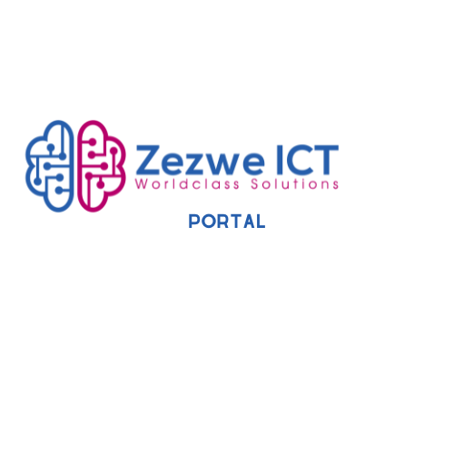

# Zezwe_ICT_Porta



## Description

<p>Introducing our cutting-edge portal designed to streamline client onboarding for companies across diverse markets. With our innovative platform, businesses can seamlessly onboard clients regardless of their geographical location or industry niche. Say goodbye to the hassle of manual paperwork and disjointed processes; our solution offers a unified interface that simplifies and accelerates the onboarding journey. Equipped with robust features and intuitive functionality, our portal empowers organizations to efficiently manage client relationships, enhance compliance, and drive business growth. Experience the future of client onboarding with our comprehensive and adaptable platform.</p>

## Table of Context

### Main App

[main.py](Flask-Web-App/main.py)

The website is ran in this file seperately using the flask framework.

### [1.](lask-Web-App/instance) Instance

[database.db](Flask-Web-App/instance/database.db)

This is where the the login infomation is stored for any new users/clients who want to use the Portal.

### [2.](Flask-Web-App/website) Website Folder

Contains the webstatic folder, bootstrap templates and python modules that have the backend part of the project

## Setup & Installation

Make sure you have the latest version of Python installed.

```bash
git clone <repo-url>
```

```bash
pip install -r requirements.txt
```

## Running The App

```bash
python main.py
```

## Viewing The App

Go to `http://127.0.0.1:5000`


